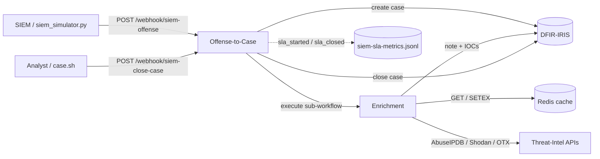

# Z-SIEM Workflows

This directory documents the two n8n workflows that make up the Z-SIEM
SIEM-to-case automation pipeline.

| Workflow | File | Purpose |
|---|---|---|
| **Offense-to-Case** | [`offense-to-case.md`](./offense-to-case.md) | Receives SIEM offenses over a webhook, opens a DFIR-IRIS case, tracks SLA, and triggers enrichment. Also closes cases and computes SLA duration. |
| **Enrichment** | [`enrichment.md`](./enrichment.md) | Sub-workflow called per case. Queries threat-intel providers (AbuseIPDB, Shodan, OTX) with Redis caching, then writes an enrichment note and registers IOCs back into the IRIS case. |
| **QRadar Offense-to-Case** | [`qradar-offense-to-case.md`](./qradar-offense-to-case.md) | Scheduled (1 min). Polls the QRadar offenses API, dedups by offense id, and feeds each new offense into the same case + SLA + enrichment pipeline. |
| **SLA Poller** | `n8n/workflows/z-siem-sla-poller.json` | Scheduled (1 min). Finds cases **closed from the IRIS GUI** whose SLA section is still pending and writes the closed date + duration + Met/Breached status — so analysts can close cases natively in IRIS. |

## How they fit together

The Offense-to-Case workflow is the **only** webhook-facing entrypoint. The
Enrichment workflow is **never** called over HTTP — it is invoked internally via
n8n's *Execute Workflow* node, so its inputs are a trusted, structured object
rather than untrusted webhook JSON.

## Service map

| Concern | Endpoint / location |
|---|---|
| n8n editor & webhooks | `http://localhost:5678` |
| DFIR-IRIS API (from n8n) | `http://iris-web:8000` (override with `IRIS_API_URL`) |
| DFIR-IRIS UI (from host) | `http://localhost:8000` |
| Redis enrichment cache | `redis:6379` (reuses the IRIS Redis instance) |
| SLA metrics log | `/home/node/.n8n/workspace/siem-sla-metrics.jsonl` (in the n8n container) |

## Editing & re-importing

The workflows are version-controlled as JSON under
[`../../n8n/workflows/`](../../n8n/workflows/). When you change a workflow in the
n8n editor, export it back to that path so the repo stays the source of truth.
Conversely, after editing the JSON, re-import it from **Workflows → Import from
File** in n8n.
