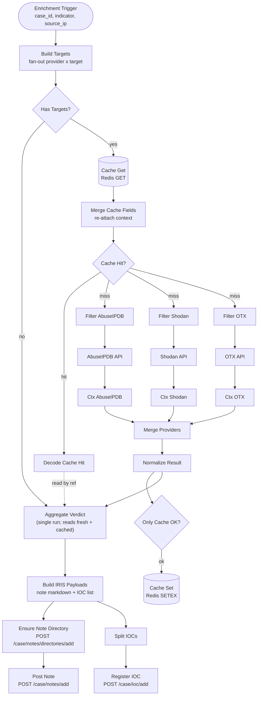

# Enrichment Workflow

**File:** [`n8n/workflows/z-siem-enrichment.json`](../../n8n/workflows/z-siem-enrichment.json)
**n8n name:** `Z-SIEM Enrichment`

A sub-workflow invoked once per case by the
[Offense-to-Case workflow](./offense-to-case.md). It takes the case's
indicators, queries threat-intel providers (with a Redis read-through cache),
aggregates a verdict, then writes an enrichment **note** and registers **IOCs**
back into the DFIR-IRIS case.

> It is **not** webhook-facing. Its only trigger is *Execute Workflow*, so the
> input is a trusted structured object, not untrusted HTTP JSON.

---

## Diagram



> **n8n 2.x compatibility:** the Redis and HTTP nodes replace the item with their
> output (dropping work-item context), so **Merge Cache Fields** and the **Ctx**
> nodes re-attach `provider`/`case_id`/`target_value` by index. **Merge Providers**
> synchronises the three provider branches into one run, and **Aggregate Verdict**
> fires once — pulling both fresh (Normalize) and cached (Decode) results by
> reference — so one offense yields exactly one note + IOC set.

---

## Input contract

Passed by the **Build Enrich Input** node of the parent workflow:

```json
{
  "case_id": 42,
  "indicator": "45.142.212.100",
  "indicator_type": "ip",
  "source_ip": "45.142.212.100"
}
```

`Build Targets` reads these defensively — it accepts the fields at top level
**or** nested under `body` / `data` / `input`, because n8n 1.x's
`executeWorkflowTrigger` may deliver them at either level depending on the
caller's mapping mode.

---

## Stage 1 — Build Targets (fan-out)

Expands the offense into one work item per **(provider × target)**.

**Target selection**

- The `indicator` is normalised to a canonical type:
  | Raw `indicator_type` | Canonical |
  |---|---|
  | `ip`, `ipv4`, `ip-src` | `ip` |
  | `domain`, `hostname` | `domain` |
  | `url` | `url` |
  | `hash`, `md5`, `sha1`, `sha256`, `file` | `hash` |
- `source_ip` is added as an `ip` target **only if it is a public IP**
  (`isPublicIp` rejects RFC1918, loopback, link-local, `0.0.0.0/8`, malformed).
- Duplicate `(type:value)` pairs are de-duplicated.

**Provider matrix**

| Target type | Providers queried |
|---|---|
| `ip` | AbuseIPDB, Shodan, OTX |
| `domain` | OTX |
| `url` | OTX |
| `hash` | OTX |

Each work item carries a deterministic `cache_key`:
`enrich:{provider}:{type}:{value}`.

**Empty case:** if there is nothing to enrich, a single `_empty: true` sentinel
item is emitted so the note step downstream still runs (and records "nothing to
enrich").

---

## Stage 2 — Cache read-through

| Node | Role |
|---|---|
| **Has Targets?** | Skips straight to `Aggregate Verdict` if only the sentinel is present. |
| **Cache Get** (Redis `GET`) | Looks up `cache_key`, stores any hit in `cached_raw`. |
| **Cache Hit?** | `cached_raw` present → **Decode Cache Hit**; else → provider filters. |
| **Decode Cache Hit** | `JSON.parse` the cached result (falls back to `ok:false` on parse error) and forwards it to `Aggregate Verdict`. |

On a **miss**, the item fans out to **three Filter nodes** in parallel —
`Filter AbuseIPDB`, `Filter Shodan`, `Filter OTX` — each passing through only
the items whose `provider` matches. This routes every work item to exactly the
right HTTP provider node.

---

## Stage 3 — Provider calls & normalisation

| Provider node | Call |
|---|---|
| **AbuseIPDB** | `GET https://api.abuseipdb.com/api/v2/check` |
| **Shodan** | Shodan host lookup |
| **OTX** | AlienVault OTX indicator lookup |

**Normalize Result** flattens each provider's response into a uniform shape and
is failure-tolerant (HTTP errors arrive as `error`/non-2xx and become
`ok:false`):

| Provider | Extracted fields | Notes |
|---|---|---|
| AbuseIPDB | `confidence`, `reports`, `country` | from `abuseConfidenceScore` etc. |
| Shodan | `ports`, `vulns`, `org` | `404` → treated as a valid "no info" result |
| OTX | `pulses`, `top` (first 3 pulse names) | from `pulse_info` |

Output per item: `{ provider, ok, data }`.

---

## Stage 4 — Cache write-back

| Node | Role |
|---|---|
| **Only Cache OK?** | Forwards to cache only when `result.ok === true` (never caches failures). |
| **Cache Set** (Redis `SETEX`) | Stores `JSON.stringify(result)` under `enrich:{provider}:{type}:{value}` with a TTL. |

**TTLs** (seconds, from environment):

| Target / provider | Env var | Default |
|---|---|---|
| IP reputation | `ENRICH_TTL_IP` | `86400` (24h) |
| Shodan host | `ENRICH_TTL_SHODAN` | `86400` (24h) |
| OTX | `ENRICH_TTL_OTX` | `86400` (24h) |
| Hashes | `ENRICH_TTL_HASH` | `604800` (7d) |

Both the cache path and the failed path then converge on **Aggregate Verdict**.

---

## Stage 5 — Aggregate Verdict

Groups all per-provider results back to **one verdict per target** keyed by
`type:value`:

- successful providers go under `sources.<provider>`;
- failed/missing ones are listed in `unavailable`;
- a human-readable `summary` is composed, e.g.
  `AbuseIPDB 85% · OTX 3 pulses · Shodan 2 ports`.

Output: `{ case_id, verdicts: [ { value, type, sources, unavailable, summary } ] }`.

---

## Stage 6 — Write back to IRIS

**Build IRIS Payloads** turns the verdicts into:

1. **One note** — a Markdown report with a per-indicator section and a
   provider/finding table.
2. **N IOC payloads** — one per verdict, with IRIS v2.4.20 type ids:

   | Target type | `ioc_type_id` |
   |---|---|
   | ip | `79` (ip-src) |
   | domain | `20` |
   | url | `141` |
   | hash (sha256 / sha1 / md5 by length 64/40/other) | `113` / `111` / `90` |

   IOCs are tagged `siem,enrichment` with `ioc_tlp_id: 2`.

The payloads are written through two parallel branches:

**Note branch**
1. **Ensure Note Directory** — `POST /case/notes/directories/add?cid={case_id}`
   creates the `SIEM Enrichment` directory (idempotent target for the note).
2. **Post Note** — `POST /case/notes/add?cid={case_id}` posts the Markdown note
   into that directory (`directory_id` from the previous response).

**IOC branch**
1. **Split IOCs** — explodes the `iocs` array into one item per IOC.
2. **Register IOC** — `POST /case/ioc/add?cid={case_id}` for each.

---

## Configuration

| Variable | Purpose | Default |
|---|---|---|
| `IRIS_API_URL` | IRIS base URL for note/IOC/dir calls | `http://iris-web:8000` |
| `ABUSEIPDB_API_KEY` | AbuseIPDB auth | _(empty → provider returns no data)_ |
| `SHODAN_API_KEY` | Shodan auth | _(empty)_ |
| `OTX_API_KEY` | AlienVault OTX auth | _(empty)_ |
| `ENRICH_TTL_IP` / `_SHODAN` / `_OTX` / `_HASH` | Cache TTLs (s) | see table above |

**Credentials in n8n**

- **IRIS API Key** — Header Auth, used by the note/IOC HTTP nodes.
- **Z-SIEM Redis** — Redis credential (`redis:6379`, password = `IRIS_REDIS_PASSWORD`).

> If a provider API key is empty, that provider's call returns no usable data;
> `Normalize Result` marks it `ok:false` and it shows as `unavailable` in the
> note — the workflow still completes. The Redis cache and IRIS API key are the
> only hard dependencies.

---

## Design notes

- **Read-through cache** keeps provider quota usage low and makes re-runs of the
  same indicator near-instant; only successful lookups are cached.
- **Failure tolerance** is end-to-end: missing keys, provider 4xx/5xx, parse
  errors, and "no data" all degrade gracefully to `unavailable` rather than
  failing the case.
- **Internal-only trigger** means inputs are trusted; validation effort is spent
  on provider responses, not on the caller.
