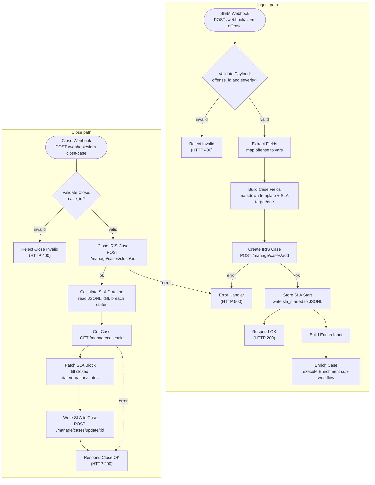

# Offense-to-Case Workflow

**File:** [`n8n/workflows/z-siem-offense-to-case.json`](../../n8n/workflows/z-siem-offense-to-case.json)
**n8n name:** `Z-SIEM Offense-to-Case Workflow`

The front door of the pipeline. It exposes two webhooks — one to **open** an
IRIS case from a SIEM offense and one to **close** it — and tracks an SLA timer
across the two events via an append-only JSONL log.

---

## Diagram



---

## Triggers

| Webhook | Method | Path | Response mode |
|---|---|---|---|
| SIEM Webhook | `POST` | `/webhook/siem-offense` | Respond via `Respond OK` node |
| Close Webhook | `POST` | `/webhook/siem-close-case` | Respond via `Respond Close OK` node |

---

## Ingest path — opening a case

### 1. SIEM Webhook
Receives the offense JSON. Expected body:

```json
{
  "offense_id": "off-2026-1234",
  "severity": "high",
  "type": "ransomware_indicator",
  "description": "Suspicious encryption activity on host",
  "source_ip": "45.142.212.100",
  "indicator": "45.142.212.100",
  "indicator_type": "ip",
  "confidence": 85,
  "asset_hostname": "WS-FINANCE-02",
  "asset_ip": "10.0.4.21"
}
```

### 2. Validate Payload (IF)
Passes only when **both** `body.offense_id` and `body.severity` are non-empty.
Anything else routes to **Reject Invalid** → `HTTP 400`. (Type validation is
`loose`, so values are coerced before the emptiness check.)

### 3. Extract Fields (Set)
Flattens `body.*` into top-level workflow variables (`offense_id`, `severity`,
`type`, `description`, `source_ip`, `indicator`, `indicator_type`, `confidence`,
`asset_hostname`, `asset_ip`). This decouples downstream nodes from the webhook
envelope shape.

### 4. Create IRIS Case (HTTP)
`POST {IRIS_API_URL}/manage/cases/add`

Builds the case from the extracted fields:

- **case_name:** `[{offense_id}] {type} from {source_ip}`
- **case_description:** offense description + indicator, confidence, asset, severity
- **case_soc_id:** `{offense_id}` (links the IRIS case back to the SIEM offense)

The node has a **second (error) output** → on any non-2xx / transport failure it
routes to **Error Handler** (`HTTP 500`) instead of crashing the execution.

### 5. Store SLA Start (Code)
- Reads the IRIS case id defensively: `data.case_id || data.id || case_id`
  (because the HTTP node has already replaced `$json` with the IRIS response, so
  `offense_id` / `severity` are pulled back from the `Extract Fields` node).
- Stamps `sla_start` (`new Date().toISOString()`), sets `sla_status: 'running'`.
- Appends an `sla_started` record to the JSONL metrics log:

  ```json
  {"case_id": 42, "offense_id": "off-2026-1234", "sla_start": "…", "severity": "high", "event": "sla_started"}
  ```

  The file write is wrapped in try/catch — a failed write is **non-blocking**
  and is surfaced as `sla_file_error` on the item rather than failing the run.

### 6. Fan-out: Respond OK + Build Enrich Input
`Store SLA Start` has two downstream connections:

- **Respond OK** → returns `HTTP 200` to the SIEM immediately.
- **Build Enrich Input** → constructs the minimal contract for the sub-workflow:

  ```json
  { "case_id": "<iris id>", "indicator": "…", "indicator_type": "…", "source_ip": "…" }
  ```

  → **Enrich Case** (*Execute Workflow*) invokes the
  [Enrichment workflow](./enrichment.md) with that object. Enrichment runs
  independently of the webhook response, so the SIEM is never blocked on
  threat-intel latency.

---

## Close path — closing a case

### Close Webhook → Validate Close Payload (IF)
`POST /webhook/siem-close-case` with body:

```json
{ "case_id": 42, "close_reason": "resolved" }
```

Validation requires a non-empty `body.case_id`; otherwise **Reject Close
Invalid** → `HTTP 400`.

### Close IRIS Case (HTTP)
`POST {IRIS_API_URL}/manage/cases/close/{case_id}`

Error output → **Error Handler** (`HTTP 500`).

### Calculate SLA Duration (Code)
- Reads `case_id` / `close_reason` from the **Close Webhook** node (the HTTP node
  again overwrote `$json`).
- Scans the JSONL log for the matching `sla_started` record (string-compared
  ids, for type safety) and computes elapsed seconds.
- Appends an `sla_closed` record:

  ```json
  {"case_id": 42, "sla_start": "…", "sla_end": "…", "sla_duration_seconds": 137, "event": "sla_closed"}
  ```

- `sla_status` reflects the outcome:
  - `completed` — start record found, duration computed
  - `closed_no_sla_record` — no matching start (e.g. case opened out-of-band)
  - `closed_log_error` — log read/parse failed

→ **Respond Close OK** returns the SLA summary as `HTTP 200`.

---

## SLA tracking model

SLA state lives in a single append-only file inside the n8n container:

```
/home/node/.n8n/workspace/siem-sla-metrics.jsonl
```

Each case produces two lines — one `sla_started` (open) and one `sla_closed`
(close) — joined on `case_id`. Because it is append-only it is crash-safe and
trivially auditable, but note:

- It is **local to the n8n container** — back it up with the n8n volume.
- Duration is computed at close time by re-reading the file, so there is no
  in-memory state to lose between executions.

---

## Error handling summary

| Failure | Routed to | Response |
|---|---|---|
| Missing `offense_id`/`severity` | Reject Invalid | `400` |
| Missing `case_id` (close) | Reject Close Invalid | `400` |
| IRIS create/close non-2xx or transport error | Error Handler | `500` |
| SLA log write fails (open) | _non-blocking_ | still `200`, `sla_file_error` set |
| SLA log read fails (close) | _non-blocking_ | still `200`, `sla_status: closed_log_error` |

---

## Configuration

| Variable | Default | Used by |
|---|---|---|
| `IRIS_API_URL` | `http://iris-web:8000` | Create / Close IRIS Case |
| IRIS API Key credential | _Header Auth_ `Authorization: Bearer <key>` | Create / Close IRIS Case |

The Enrichment sub-workflow must be present and importable for the
**Enrich Case** node to resolve. See [enrichment.md](./enrichment.md).

---

## Testing

```bash
# Send 3 simulated offenses
./z-siem.sh demo

# Close a case manually
curl -X POST http://localhost:5678/webhook/siem-close-case \
  -H "Content-Type: application/json" \
  -d '{"case_id": 1, "close_reason": "resolved"}'
```

Inspect executions in the n8n UI (`http://localhost:5678`) and the created cases
in IRIS (`http://localhost:8000`).
