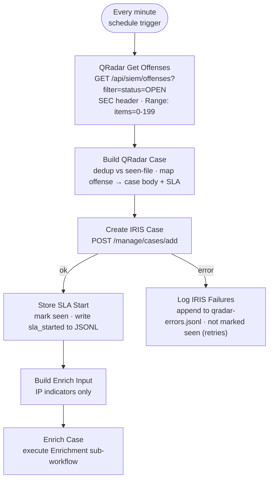

# QRadar Offense-to-Case Workflow

**File:** [`n8n/workflows/z-siem-qradar-poller.json`](../../n8n/workflows/z-siem-qradar-poller.json)
**n8n name:** `Z-SIEM QRadar Offense-to-Case`

A **pull**-based ingest path (vs. the webhook [Offense-to-Case](offense-to-case.md)
workflow's push). It polls the QRadar offenses API on a schedule, deduplicates,
and feeds each new offense into the same IRIS case + SLA + enrichment pipeline.

---

## Diagram

---

## How it works

1. **Every minute** — schedule trigger fires the poll.
2. **QRadar Get Offenses** — `GET https://<qradar>/api/siem/offenses?filter=status=OPEN`
   with the `SEC` header (the **`QRadar SEC`** credential) and a `Range: items=0-199`
   header (QRadar ignores `range` as a query param). Self-signed appliance certs are
   allowed via `allowUnauthorizedCerts` — remediate by trusting the QRadar CA
   (`NODE_EXTRA_CA_CERTS`) and removing the flag.
3. **Build QRadar Case** — reads `qradar-seen-offenses.json` and **skips offenses
   already turned into a case** (dedup). For each new offense it maps QRadar fields
   into the shared case body:
   - `magnitude` (1-10) → severity + SLA target: `critical 4h · high 8h · medium/low 24h`
   - `offense_type` → indicator type (`0`/`1` = IP, `3` = account, …)
   - `offense_source` → indicator / source IP
   - `categories`, `rules`, `log_sources`, `source_network`, `destination_networks`
     → markdown detection table
4. **Create IRIS Case** — `POST /manage/cases/add` (the `IRIS API Key` credential).
   `case_soc_id = QR-<offense_id>`.
5. **Store SLA Start** — records the offense→case mapping in the seen-file (only on
   success, so failures retry) and appends an `sla_started` event to
   `siem-sla-metrics.jsonl`. The [SLA Poller](offense-to-case.md#sla-poller) completes
   the SLA block when the case is closed in the IRIS GUI (same sentinels).
6. **Log IRIS Failures** — offenses whose case creation failed are appended to
   `qradar-errors.jsonl` and are **not** marked seen, so they are retried next poll.
7. **Build Enrich Input → Enrich Case** — fires the Enrichment sub-workflow for real
   IP indicators only (skips `unknown`/non-IP).

## Setup

Create a **Header Auth** credential named `QRadar SEC` with header name `SEC` and
value = the QRadar API token, then import + activate the workflow. Host URLs are
read from `$env.QRADAR_API_URL` and `$env.IRIS_API_URL` (set them in
`config/n8n.env` / the n8n container env) — no hostnames or IPs are baked into the
workflow file.

## State files (in the n8n data volume, `/home/node/.n8n/workspace/`)

| File | Purpose |
| --- | --- |
| `qradar-seen-offenses.json` | Dedup map `offense_id → { case_id, at }` |
| `siem-sla-metrics.jsonl` | Shared SLA event log (start/close) |
| `qradar-errors.jsonl` | Offenses whose IRIS case creation failed |

> The code nodes `mkdir -p` the workspace dir before writing, so the dedup state
> persists reliably (a missing dir was the original cause of duplicate cases).
