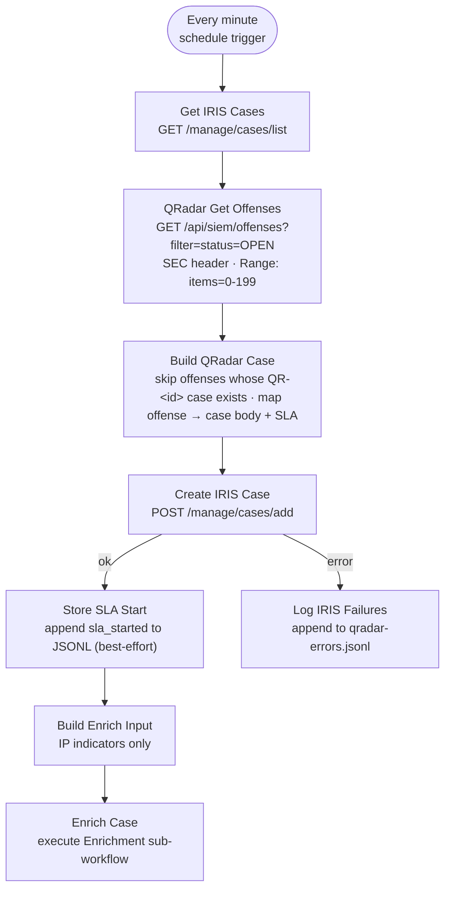

# QRadar Offense-to-Case Workflow

**File:** [`n8n/workflows/z-siem-qradar-poller.json`](../../n8n/workflows/z-siem-qradar-poller.json)
**n8n name:** `Z-SIEM QRadar Offense-to-Case`

A **pull**-based ingest path (vs. the webhook [Offense-to-Case](offense-to-case.md)
workflow's push). It polls the QRadar offenses API on a schedule and feeds each
new offense into the same IRIS case + SLA + enrichment pipeline.

**Deduplication is authoritative:** before creating anything, the workflow reads
the existing IRIS cases and skips any offense whose `QR-<id>` case already exists.
The case's existence *is* the dedup record — there is no side file or store that
can drift, so an offense can never become two cases.

---

## Diagram

---

## How it works

1. **Every minute** — schedule trigger fires the poll.
2. **Get IRIS Cases** — `GET /manage/cases/list`. **Fail-closed:** if this call
   errors the poll stops rather than risk creating duplicates.
3. **QRadar Get Offenses** — `GET /api/siem/offenses?filter=status=OPEN` with the
   `SEC` header (the **`QRadar SEC`** credential) and a `Range: items=0-199` header
   (QRadar ignores `range` as a query param). Self-signed appliance certs are
   allowed via `allowUnauthorizedCerts` — remediate by trusting the QRadar CA
   (`NODE_EXTRA_CA_CERTS`) and removing the flag.
4. **Build QRadar Case** — builds a set of `case_soc_id` values (`QR-…`) from the
   IRIS case list and **skips any offense whose `QR-<id>` already exists**. For each
   new offense it maps QRadar fields into the shared case body:
   - `magnitude` (1-10) → severity + SLA target: `critical 4h · high 8h · medium/low 24h`
   - `offense_type` → indicator type (`0`/`1` = IP, `3` = account, …)
   - `offense_source` → indicator / source IP
   - `categories`, `rules`, `log_sources`, `source_network`, `destination_networks`
     → markdown detection table
5. **Create IRIS Case** — `POST /manage/cases/add` (the `IRIS API Key` credential).
   `case_soc_id = QR-<offense_id>` — this is the key the next poll dedups against.
6. **Store SLA Start** — appends an `sla_started` event to `siem-sla-metrics.jsonl`
   (best-effort) so the [SLA Poller](offense-to-case.md#sla-poller) can complete the
   SLA block when the case is closed in the IRIS GUI (same sentinels). Dedup does
   **not** depend on this step.
7. **Log IRIS Failures** — offenses whose case creation failed are appended to
   `qradar-errors.jsonl`; the next poll retries them (their case still doesn't exist).
8. **Build Enrich Input → Enrich Case** — fires the Enrichment sub-workflow for real
   IP indicators only (skips `unknown`/non-IP).

## Setup

Create a **Header Auth** credential named `QRadar SEC` (header name `SEC`, value =
the QRadar API token), then import + activate the workflow and bind the `QRadar SEC`
and `IRIS API Key` credentials to the HTTP nodes. Host URLs are read from
`$env.QRADAR_API_URL` and `$env.IRIS_API_URL` (set them in `config/n8n.env` / the
n8n container env) — no hostnames or IPs are baked into the workflow file.

## State files (in the n8n data volume, `/home/node/.n8n/workspace/`)

| File | Purpose |
| --- | --- |
| `siem-sla-metrics.jsonl` | Shared SLA event log (start/close) — best-effort |
| `qradar-errors.jsonl` | Offenses whose IRIS case creation failed |

> Dedup no longer uses a state file. Earlier versions kept a
> `qradar-seen-offenses.json` seen-list, but relying on a post-create write meant a
> single missed/failed write re-created every offense. Checking IRIS directly
> removes that failure mode entirely.
